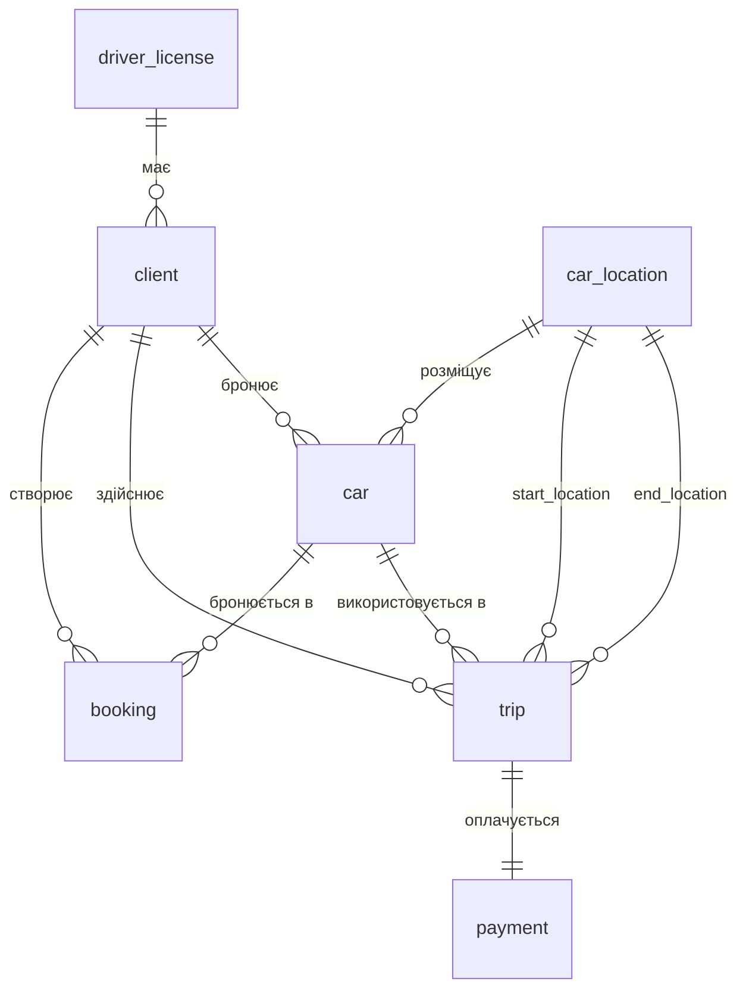

# Лабораторна робота 2: База даних прокату автомобілів

## Створення бази даних

Ця база даних розроблена для системи каршерингу (прокату автомобілів). Вона дозволяє клієнтам бронювати автомобілі, здійснювати поїздки, обробляти платежі та відстежувати локації транспортних засобів. Схема складається з 7 основних таблиць та 6 користувацьких типів ENUM, які забезпечують цілісність та ефективність роботи з даними.

### Діаграма схеми (ERD)



### Опис таблиць, ключів та обмежень

1. **driver_license** - Зберігає дані про водійські посвідчення.

   * `driver_license_id` (PK): Унікальний числовий ідентифікатор.
   * `license_number` (UNIQUE): Номер посвідчення, фіксованої довжини 10 символів. **Обмеження**: Кожен номер унікальний.
   * `license_type`: ENUM-тип ('A', 'B', 'C', 'D', 'E'), що визначає категорію водійського посвідчення.
   * `expiry_date`: Дата закінчення терміну дії посвідчення.

2. **client** - Зберігає інформацію про клієнтів системи.

   * `client_id` (PK): Унікальний ідентифікатор клієнта.
   * `email` (UNIQUE): Електронна адреса, унікальна для кожного користувача.
   * `firstname`, `lastname`: Ім'я та прізвище клієнта.
   * `driver_license` (FK): Зовнішній ключ, що посилається на `driver_license(driver_license_id)`. **Припущення**: Кожен клієнт повинен мати водійське посвідчення (NOT NULL).

3. **car_location** - Зберігає локації, де можуть знаходитися автомобілі.

   * `car_location_id` (PK): Унікальний ідентифікатор локації.
   * `address`: Текстова адреса локації (до 255 символів).

4. **car** - Зберігає інформацію про автомобілі в системі.

   * `car_id` (PK): Унікальний ідентифікатор автомобіля.
   * `license_plate` (UNIQUE): Номерний знак автомобіля, унікальний для кожного авто.
   * `car_type`: Тип автомобіля (Sedan, SUV, Hatchback тощо).
   * `fuel`: ENUM-тип ('Petrol', 'Diesel', 'Electric', 'Hybrid'), що визначає тип палива.
   * `price`: Ціна оренди (CHECK: price > 0).
   * `status`: ENUM-тип ('Available', 'Booked', 'Repaired'), що визначає поточний стан автомобіля.
   * `booked_by` (FK, nullable): Зовнішній ключ, що посилається на `client(client_id)`. **Припущення**: Може бути NULL, якщо автомобіль вільний.
   * `is_in` (FK, NOT NULL): Зовнішній ключ, що посилається на `car_location(car_location_id)`. **Обмеження**: Кожен автомобіль завжди має знаходитися в певній локації.

5. **booking** - Зберігає бронювання автомобілів клієнтами.

   * `book_id` (PK): Унікальний ідентифікатор бронювання.
   * `user_id` (FK, NOT NULL): Зовнішній ключ, що посилається на `client(client_id)`.
   * `car_id` (FK, NOT NULL): Зовнішній ключ, що посилається на `car(car_id)`.
   * `status`: ENUM-тип ('pending', 'confirmed', 'completed'), що визначає статус бронювання. **Припущення**: За замовчуванням 'pending'.

6. **trip** - Зберігає інформацію про поїздки.

   * `trip_id` (PK): Унікальний ідентифікатор поїздки.
   * `car_id` (FK, NOT NULL): Зовнішній ключ, що посилається на `car(car_id)`.
   * `user_id` (FK, NOT NULL): Зовнішній ключ, що посилається на `client(client_id)`.
   * `start_time`, `end_time`: Часові мітки початку та завершення поїздки. **Припущення**: `start_time` має значення за замовчуванням NOW().
   * `duration`: Тривалість поїздки (зберігається як текст для гнучкості формату).
   * `price`: Вартість поїздки (CHECK: price >= 0, може бути NULL).
   * `start_location` (FK, NOT NULL), `end_location` (FK, NOT NULL): Зовнішні ключі, що посилаються на `car_location(car_location_id)`. **Припущення**: Локації початку та кінця можуть співпадати.

7. **payment** - Зберігає інформацію про платежі за поїздки.

   * `payment_id` (PK): Унікальний ідентифікатор платежу.
   * `payment_date`: Дата та час здійснення платежу.
   * `amount`: Сума платежу (CHECK: amount > 0).
   * `payment_type`: ENUM-тип ('Credit Card', 'Debit Card', 'Gift Card').
   * `transaction_method`: ENUM-тип ('Online', 'POS'), що визначає спосіб проведення транзакції.
   * `status`: ENUM-тип ('pending', 'confirmed', 'completed'). **Припущення**: За замовчуванням 'pending'.
   * `trip_id` (FK, NOT NULL): Зовнішній ключ, що посилається на `trip(trip_id)`. **Обмеження**: Кожен платіж пов'язаний з конкретною поїздкою.

### Користувацькі типи (ENUM)

База використовує 6 користувацьких типів для забезпечення валідності даних:

* `license` - категорії водійських прав
* `fuel` - типи палива
* `status` - загальні статуси (для бронювань та платежів)
* `car_status` - статуси автомобіля
* `payment_type` - типи платіжних карт
* `transaction` - методи транзакцій

### Важливі припущення та обмеження

* **Цілісність даних**: Усі зовнішні ключі забезпечують референційну цілісність між таблицями.
* **Унікальність**: Поля `license_number`, `email` та `license_plate` мають обмеження UNIQUE.
* **CHECK-обмеження**: Ціни (`car.price`, `payment.amount`) мають бути більшими за 0; `trip.price` може бути >= 0 або NULL.
* **Каскадне видалення**: Не налаштовано в поточній схемі. При видаленні клієнта або автомобіля необхідно спочатку обробити пов'язані записи.
* **Автоматичні значення**: `booking.status` та `payment.status` за замовчуванням мають значення 'pending'; `trip.start_time` автоматично встановлюється в поточний час.

### Доказ заповнення таблиць

Кожна таблиця містить 5 рядків тестових даних:

| Таблиця | Кількість рядків |
|---------|------------------|
| driver_license | 5 |
| client | 5 |
| car_location | 5 |
| car | 5 |
| booking | 5 |
| trip | 5 |
| payment | 5 |

**Приклади даних:**

* **driver_license**: Посвідчення категорій A та B з термінами дії до 2026-2032 років
* **client**: 5 клієнтів з унікальними email-адресами (`john.doe@example.com`, `jane.smith@example.com` тощо)
* **car_location**: 5 локацій у різних районах міста (City Center, Downtown, Suburbs, Old Town, Riverside)
* **car**: Різні типи автомобілів (Sedan, SUV, Hatchback, Coupe, Convertible) з різними статусами
* **booking**: Бронювання зі статусами 'pending', 'confirmed' та 'completed'
* **trip**: 5 завершених поїздок тривалістю 1.5-2 години
* **payment**: Платежі з різними типами карт та методами транзакцій

### SQL-скрипт

Повний SQL-скрипт з усіма операторами CREATE TABLE та INSERT знаходиться у файлі [`lab2.sql`](./lab2.sql).

Структура скрипту:

1. Створення користувацьких типів (ENUM)
2. Створення таблиць (з коментарями для ідентифікації)
3. Вставка даних (INSERT) для кожної таблиці

### Перевірка роботи бази даних

Для перевірки створення та заповнення таблиць можна виконати наступні SQL-запити:

```sql
-- Перевірка кількості записів у кожній таблиці
SELECT 'driver_license' as table_name, COUNT(*) as row_count FROM driver_license
UNION ALL
SELECT 'client', COUNT(*) FROM client
UNION ALL
SELECT 'car_location', COUNT(*) FROM car_location
UNION ALL
SELECT 'car', COUNT(*) FROM car
UNION ALL
SELECT 'booking', COUNT(*) FROM booking
UNION ALL
SELECT 'trip', COUNT(*) FROM trip
UNION ALL
SELECT 'payment', COUNT(*) FROM payment;

-- Перегляд всіх даних з таблиць
SELECT * FROM driver_license;
SELECT * FROM client;
SELECT * FROM car_location;
SELECT * FROM car;
SELECT * FROM booking;
SELECT * FROM trip;
SELECT * FROM payment;
```


