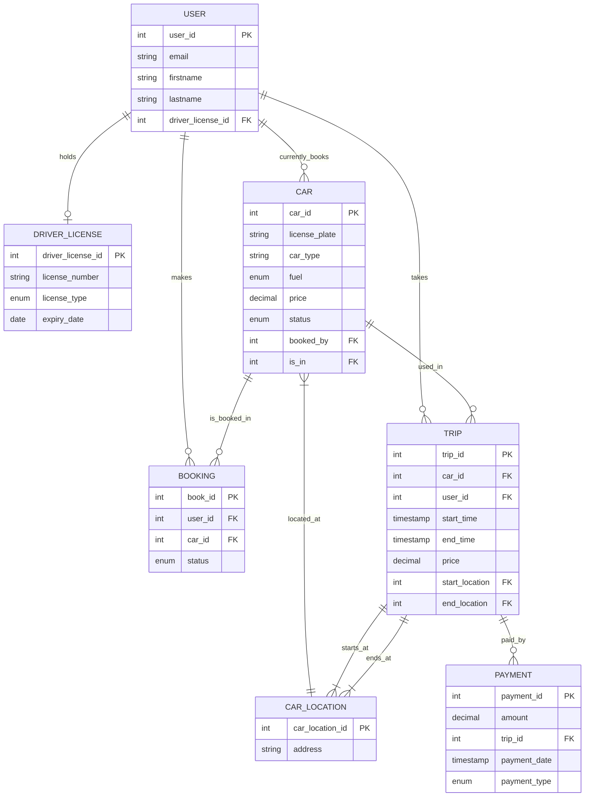
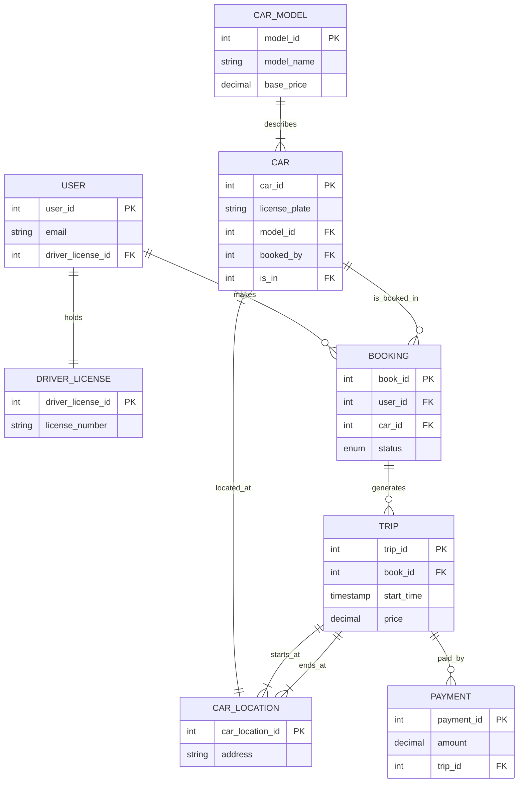

# ER Diagrams (Car Rental Service)

## 1\. Початкова ER-діаграма

```mermaid
erDiagram
    DRIVER_LICENSE {
        int driver_license_id PK
        string license_number
        enum license_type
        date expiry_date
    }
    USER {
        int user_id PK
        string email
        string firstname
        string lastname
        int driver_license_id FK
    }
    CAR_LOCATION {
        int car_location_id PK
        string address
    }
    CAR {
        int car_id PK
        string license_plate
        string car_type
        enum fuel
        decimal price
        enum status
        int booked_by FK
        int is_in FK
    }
    BOOKING {
        int book_id PK
        int user_id FK
        int car_id FK
        enum status
    }
    TRIP {
        int trip_id PK
        int car_id FK
        int user_id FK
        timestamp start_time
        timestamp end_time
        decimal price
        int start_location FK
        int end_location FK
    }
    PAYMENT {
        int payment_id PK
        decimal amount
        int trip_id FK
        timestamp payment_date
        enum payment_type
    }

    USER ||--o| DRIVER_LICENSE : holds
    USER ||--o{ BOOKING : makes
    USER ||--o{ TRIP : takes
    USER ||--o{ CAR : currently_books

    CAR }|--|| CAR_LOCATION : located_at
    CAR ||--o{ BOOKING : is_booked_in
    CAR ||--o{ TRIP : used_in

    TRIP ||--|{ CAR_LOCATION : starts_at
    TRIP ||--|{ CAR_LOCATION : ends_at
    TRIP ||--o{ PAYMENT : paid_by
```

## 2\. Фінальна ER-діаграма

```mermaid
erDiagram
    DRIVER_LICENSE {
        int driver_license_id PK
        string license_number
    }
    USER {
        int user_id PK
        string email
        int driver_license_id FK
    }
    CAR_LOCATION {
        int car_location_id PK
        string address
    }
    CAR_MODEL {
        int model_id PK
        string model_name
        decimal base_price
    }
    CAR {
        int car_id PK
        string license_plate
        int model_id FK
        int booked_by FK
        int is_in FK
    }
    BOOKING {
        int book_id PK
        int user_id FK
        int car_id FK
        enum status
    }
    TRIP {
        int trip_id PK
        int book_id FK
        timestamp start_time
        decimal price
    }
    PAYMENT {
        int payment_id PK
        decimal amount
        int trip_id FK
    }

    USER ||--|| DRIVER_LICENSE : holds
    USER ||--o{ BOOKING : makes
    CAR_MODEL ||--|{ CAR : describes
    CAR ||--o{ BOOKING : is_booked_in
    CAR }|--|| CAR_LOCATION : located_at
    
    BOOKING ||--o{ TRIP : generates
    
    TRIP ||--|{ CAR_LOCATION : starts_at
    TRIP ||--|{ CAR_LOCATION : ends_at
    TRIP ||--o{ PAYMENT : paid_by
```
